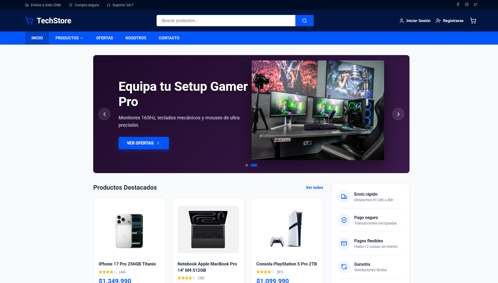
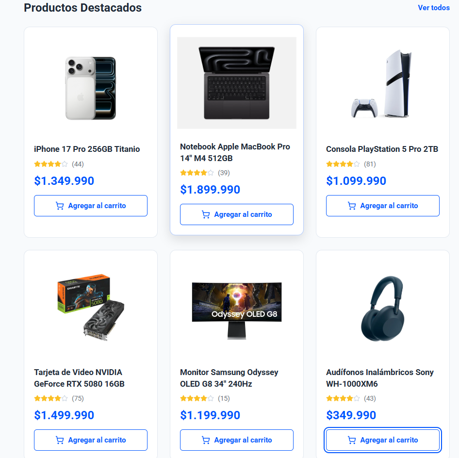
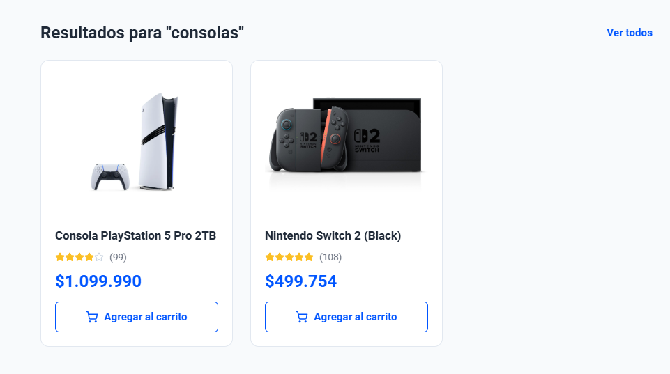
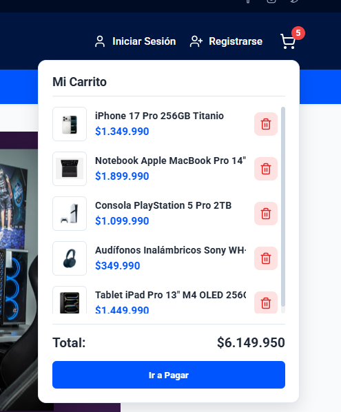
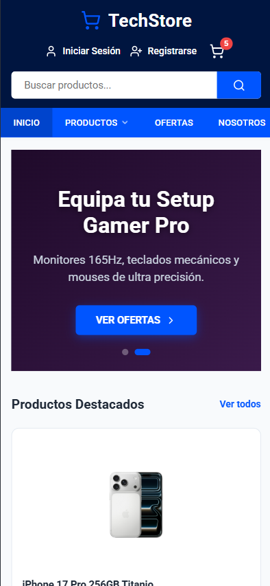
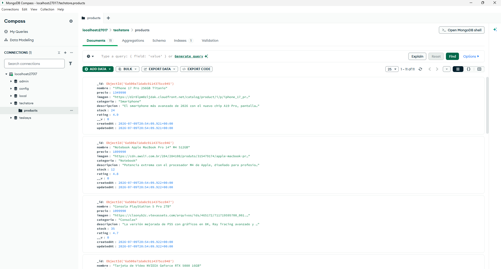
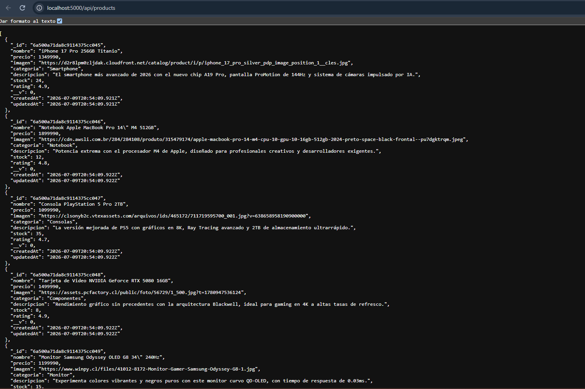

# TechStore

## Desarrollo de una Tienda Virtual de Tecnología

**Autor:** Sergio Campos
**Carrera:** Ingeniería en Informática  
**Asignatura:** Programación Front-End  
**Modalidad:** Trabajo Individual

---

# Descripción

TechStore es una aplicación web de comercio electrónico desarrollada como proyecto de la asignatura Programación Front-End. Su objetivo es representar una tienda virtual moderna dedicada a la venta de productos tecnológicos, implementando una arquitectura cliente-servidor utilizando React para el frontend y Node.js con Express para el backend, integrando MongoDB como sistema de base de datos.

La aplicación fue diseñada siguiendo el mockup entregado como referencia, incorporando además mejoras visuales y funcionales para ofrecer una experiencia de usuario más moderna, intuitiva y responsive.

---

# Objetivos

## Objetivo General

Desarrollar una aplicación web responsiva para la venta de productos tecnológicos utilizando tecnologías modernas de desarrollo web.

## Objetivos Específicos

- Implementar una interfaz moderna utilizando React.
- Aplicar programación basada en componentes.
- Consumir información desde una API REST.
- Implementar un backend utilizando Express.
- Integrar una base de datos MongoDB mediante Mongoose.
- Utilizar Git y GitHub para el control de versiones.
- Aplicar principios de diseño responsive.

---

# Tecnologías Utilizadas

## Frontend

- React
- Vite
- JavaScript (ES6)
- HTML5
- CSS3
- React Router DOM
- Axios
- React Icons

## Backend

- Node.js
- Express.js

## Base de Datos

- MongoDB
- Mongoose

## Herramientas

- Visual Studio Code
- Git
- GitHub
- MongoDB Compass
- Postman

---

# Características del Proyecto

- Página principal inspirada en el mockup entregado.
- Diseño moderno y responsive.
- Barra superior con redes sociales y acceso de usuario.
- Barra de navegación.
- Banner principal.
- Catálogo dinámico de productos.
- Buscador de productos.
- Carrito de compras.
- Sidebar con beneficios de la tienda.
- Footer con información institucional.
- API REST desarrollada con Express.
- Persistencia de datos utilizando MongoDB.

---

# Funcionalidades Implementadas

- Visualización dinámica de productos.
- Renderizado utilizando `map()`.
- Filtrado mediante `filter()`.
- Manejo de estados utilizando `useState`.
- Comunicación entre componentes mediante Props.
- Consumo de API con Axios.
- Organización modular del proyecto.
- Diseño adaptable para dispositivos móviles.

---

# Estructura del Proyecto

```
techstore/

├── frontend/
│
│   ├── src/
│   │
│   ├── assets/
│   ├── components/
│   ├── pages/
│   ├── styles/
│   ├── data/
│   ├── App.jsx
│   └── main.jsx
│
└── backend/
    │
    ├── config/
    ├── controllers/
    ├── middlewares/
    ├── models/
    ├── routes/
    ├── server.js
    └── package.json
```

---

# Instalación

## 1. Clonar el repositorio

```bash
git clone https://github.com/bastidev-wav/techstore
```

Entrar al proyecto

```bash
cd techstore
```

---

# Configuración del Frontend

Entrar a la carpeta:

```bash
cd frontend
```

Instalar dependencias:

```bash
npm install
```

Ejecutar el proyecto:

```bash
npm run dev
```

El frontend estará disponible en:

```
http://localhost:5173
```

---

# Configuración del Backend

Entrar a la carpeta:

```bash
cd backend
```

Instalar dependencias:

```bash
npm install
```

Crear un archivo `.env`

Ejemplo:

```env
PORT=5000
MONGO_URL=mongodb://localhost:27017/techstore
```

Ejecutar el servidor:

```bash
npm run dev
```

El backend estará disponible en:

```
http://localhost:5000
```

---

# API REST

## Productos

### Obtener productos

```
GET /api/products
```

### Obtener un producto

```
GET /api/products/:id
```

### Crear producto

```
POST /api/products
```

### Actualizar producto

```
PUT /api/products/:id
```

### Eliminar producto

```
DELETE /api/products/:id
```

---

# Base de Datos

El proyecto utiliza MongoDB mediante Mongoose.

El modelo principal corresponde a **Product**, encargado de almacenar la información de los productos tecnológicos.

Campos principales:

- Nombre
- Precio
- Imagen
- Categoría
- Descripción
- Stock
- Valoración

---

# Capturas del Proyecto


## Página principal.


---
## Catálogo de productos.

---
## Buscador.

---
## Carrito.

---
## Responsive.

---
## MongoDB Compass.

---
## API funcionando.

---

---

# Dificultades Encontradas

Durante el desarrollo se presentaron diversos desafíos, entre ellos:

- Organización inicial del proyecto.
- Comunicación entre React y Express.
- Configuración de MongoDB.
- Implementación del buscador.
- Manejo del carrito mediante `useState`.
- Adaptación responsive del Header y Navbar.

Cada uno fue resuelto mediante pruebas, documentación oficial e investigación.

---

# Conclusiones

El desarrollo de TechStore permitió aplicar de forma práctica los conocimientos adquiridos durante el semestre en tecnologías Front-End y Back-End.

El proyecto fortaleció competencias relacionadas con:

- Desarrollo en React.
- Componentización.
- Manejo de estados.
- Desarrollo de APIs REST.
- Integración con MongoDB.
- Organización profesional del código.
- Diseño responsive.

Asimismo, permitió comprender la importancia de una correcta separación entre frontend y backend, así como el uso de herramientas modernas para el desarrollo de aplicaciones web.

---

# Autor

**Sergio Campos**

Proyecto desarrollado de manera **individual** para la asignatura **Programación Front-End** de la carrera **Ingeniería en Informática**.